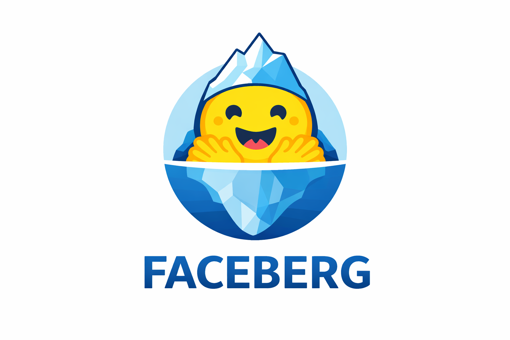

# Faceberg

Bridge HuggingFace datasets with Apache Iceberg tables.

## Installation

```bash
pip install faceberg
```

## Quick Start

```bash
# Create a catalog and add a dataset
faceberg mycatalog init
faceberg mycatalog add stanfordnlp/imdb --config plain_text
faceberg mycatalog sync

# Query the data
faceberg mycatalog scan default.imdb --limit 5
```

**Python API:**

```python
from faceberg import catalog

cat = catalog("mycatalog")
table = cat.load_table("default.imdb")
df = table.scan().to_pandas()
print(df.head())
```

**Documentation:**
- [Getting Started](docs/index.qmd) - Quickstart guide
- [Local Catalogs](docs/local.qmd) - Use local catalogs for testing
- [DuckDB Integration](docs/integrations/duckdb.qmd) - Query with SQL
- [Pandas Integration](docs/integrations/pandas.qmd) - Load into DataFrames

## How It Works

Faceberg creates lightweight Iceberg metadata that points to original HuggingFace dataset files:

```
HuggingFace Dataset          Your Catalog
┌─────────────────┐         ┌──────────────────┐
│ org/dataset     │         │ mycatalog/       │
│ ├── train.pq ◄──┼─────────┼─ default/        │
│ └── test.pq  ◄──┼─────────┼─   └── imdb/     │
└─────────────────┘         │       └── metadata/
                            └──────────────────┘
```

No data is copied—only metadata is created. Query with DuckDB, PyIceberg, Spark, or any Iceberg-compatible tool.

## Usage

### CLI Commands

```bash
# Initialize catalog
faceberg mycatalog init

# Add datasets
faceberg mycatalog add openai/gsm8k --config main

# Sync datasets (creates Iceberg metadata)
faceberg mycatalog sync

# List tables
faceberg mycatalog list

# Show table info
faceberg mycatalog info default.gsm8k

# Scan data
faceberg mycatalog scan default.gsm8k --limit 10

# Start REST server
faceberg mycatalog serve --port 8181
```

### Remote Catalogs on HuggingFace Hub

```bash
# Initialize remote catalog
export HF_TOKEN=your_token
faceberg org/catalog-repo init

# Add and sync datasets
faceberg org/catalog-repo add deepmind/code_contests --config default
faceberg org/catalog-repo sync

# Serve remote catalog
faceberg org/catalog-repo serve
```

### Query with DuckDB

```python
import duckdb

conn = duckdb.connect()
conn.execute("INSTALL httpfs; LOAD httpfs")
conn.execute("INSTALL iceberg; LOAD iceberg")

# Query local catalog
result = conn.execute("""
    SELECT * FROM iceberg_scan('mycatalog/default/imdb/metadata/v1.metadata.json')
    LIMIT 10
""").fetchall()

# Query remote catalog
result = conn.execute("""
    SELECT * FROM iceberg_scan('hf://datasets/org/catalog/default/table/metadata/v1.metadata.json')
    LIMIT 10
""").fetchall()
```

## Development

```bash
git clone https://github.com/kszucs/faceberg
cd faceberg
pip install -e .
```

## License

Apache 2.0
